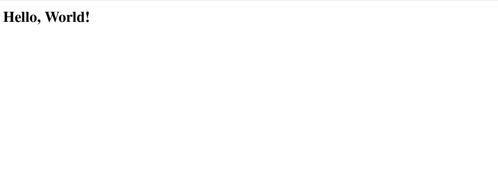

# Hello, World!

The traditional _Hello, World!_ application: the most minimal WebEngine application possible.

This blueprint displays the message "Hello, World!" in an `<h1>` tag and does not have any other functionality.

To run: `composer install` to set up the project, `gt run` to start the server, then visit http://localhost:8080
